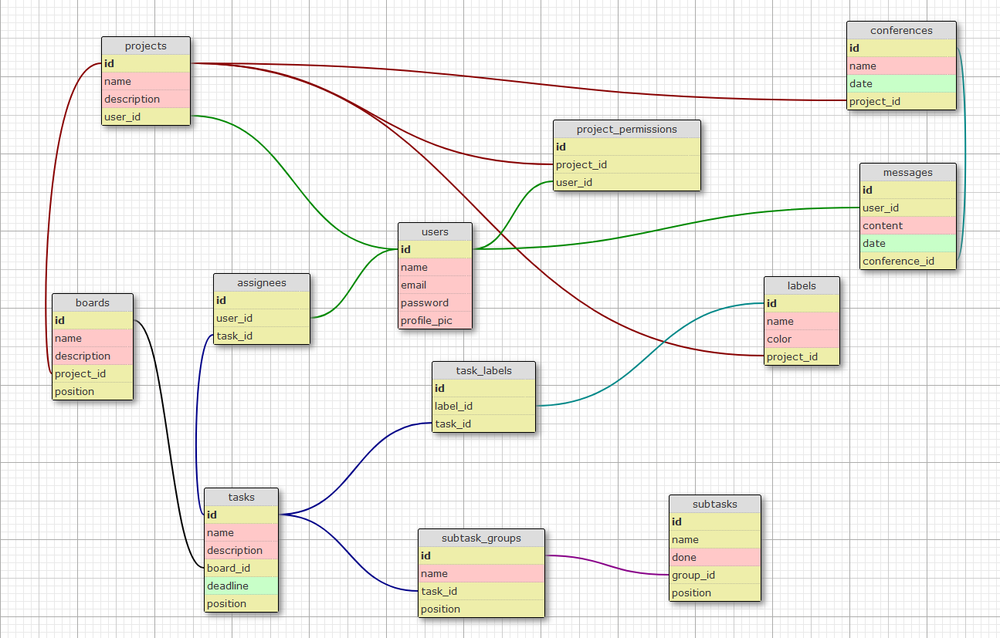

# FlowBoard - Simplify your creative projects management

## Description

FlowBoard is a solution designed specifically for small teams of creative freelancers looking to centralize their projects and task management. Our goal is to simplify online project management, optimize collaboration, and efficiently track tasks.

## Features

- Intuitive visual board for easy planning, tracking, and collaboration on projects.
- User-friendly interface for easy navigation and use.
- Intuitive features for a smooth user experience.

## Originality

FlowBoard reinvents project management with its innovative design and intuitive features. Our user-friendly interface provides an enjoyable and efficient project management experience, allowing teams to focus on their creative work without being hindered by complex tools.

## How it works

1. **Create your project board**: Start by creating a board for your project and organize it according to your needs.
2. **Add tasks and collaborators**: Add tasks to your board and assign them to your collaborators.
3. **Track progress in real-time**: Easily track the progress of your projects and assigned tasks through our intuitive visual board.
4. **Collaborate efficiently**: Facilitate collaboration by discussing tasks directly and sharing files within FlowBoard.

## Why FlowBoard?

- **Simplicity**: FlowBoard simplifies project management for creative teams by offering a user-friendly interface and intuitive features.
- **Efficiency**: Our visual board makes it easy to track and collaborate on projects efficiently, facilitating communication and coordination among team members.
- **Innovation**: We reinvent online project management with FlowBoard, providing a unique solution tailored to the needs of small teams of creative freelancers.

## Technology Stack

FlowBoard was created using the following technologies:

- **Ruby on Rails**: Backend framework for building web applications.
- **Stimulus**: JavaScript framework for building interactive web interfaces.
- **PostgreSQL**: Relational database management system.
- **Redis**: In-memory data structure store used as a database, cache, and message broker.
- **Bootstrap**: Frontend framework for building responsive and mobile-first websites.
- **Devise**: Ruby gem for user authentication.
- **SimpleForm**: Ruby gem for form creation and customization.
- **ActsAsList**: Ruby gem for managing ordered lists.

## Database Schema
Please note that some of the elements were not implemented

## Get Started Today!

Join thousands of creative teams already using FlowBoard to simplify their project management and optimize their collaboration. Sign up now and start creating, collaborating, and succeeding with FlowBoard!

For more information, visit our website: [www.flowboard.com](https://www.flowboard.com)
